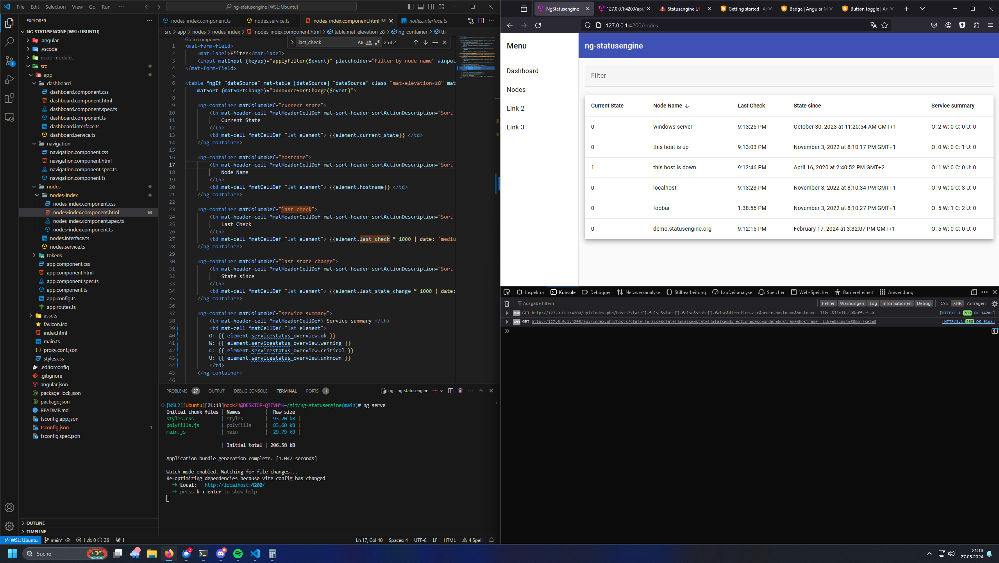

# NgStatusengine

Simples Projekt welches die API von demo.statusengine.org abfragt.

Das Angular Projekt kann local ausgeführt werden, da es die `Proxy-Option` von Angular
nutzt um die Requests an `https://demo.statusengine.org/api` weiter zu leiten.



## setup

Angular installieren (falls noch nicht)

```
npm install -g @angular/cli
```

Repo Clonen

Lokalen server starten
```
ng serve
```


---

## nützliches

TypeScript interfaces von einem JSON erzeugen: https://transform.tools/json-to-typescript
